# Sơ Đồ Lớp - Apartment Fee Management App

## Mục lục
1. [Sơ Đồ Lớp Phân Tích (BCE Pattern)](#1-sơ-đồ-lớp-phân-tích-bce-pattern)
2. [Sơ Đồ Lớp Chi Tiết](#2-sơ-đồ-lớp-chi-tiết)

---

## 1. Sơ Đồ Lớp Phân Tích (BCE Pattern)

### 1.1 Tổng Quan Hệ Thống

```mermaid
%%{init: {'theme': 'base', 'themeVariables': { 'primaryColor': '#ffffcc', 'primaryBorderColor': '#333'}}}%%
classDiagram
    direction TB
    
    %% Boundary Classes
    class LoginView {
        <<boundary>>
    }
    class DashboardView {
        <<boundary>>
    }
    class HouseholdsView {
        <<boundary>>
    }
    class FeeCollectionView {
        <<boundary>>
    }
    class ParkingView {
        <<boundary>>
    }
    class UtilitiesView {
        <<boundary>>
    }
    class StatisticsView {
        <<boundary>>
    }
    class SettingsView {
        <<boundary>>
    }
    
    %% Control Classes
    class AuthController {
        <<control>>
    }
    class HouseholdController {
        <<control>>
    }
    class MemberController {
        <<control>>
    }
    class FeeCategoryController {
        <<control>>
    }
    class PaymentController {
        <<control>>
    }
    class ParkingController {
        <<control>>
    }
    class UtilityController {
        <<control>>
    }
    class StatisticsController {
        <<control>>
    }
    class UserController {
        <<control>>
    }
    
    %% Entity Classes
    class User {
        <<entity>>
    }
    class Household {
        <<entity>>
    }
    class HouseholdMember {
        <<entity>>
    }
    class FeeCategory {
        <<entity>>
    }
    class Payment {
        <<entity>>
    }
    class ParkingSlot {
        <<entity>>
    }
    class UtilityBill {
        <<entity>>
    }
    class Setting {
        <<entity>>
    }
    
    %% Boundary -> Control relationships
    LoginView --> AuthController
    HouseholdsView --> HouseholdController
    HouseholdsView --> MemberController
    FeeCollectionView --> PaymentController
    FeeCollectionView --> FeeCategoryController
    ParkingView --> ParkingController
    UtilitiesView --> UtilityController
    StatisticsView --> StatisticsController
    SettingsView --> UserController
    
    %% Control -> Entity relationships
    AuthController --> User
    HouseholdController --> Household
    MemberController --> HouseholdMember
    FeeCategoryController --> FeeCategory
    PaymentController --> Payment
    PaymentController --> Household
    ParkingController --> ParkingSlot
    UtilityController --> UtilityBill
    StatisticsController --> Household
    StatisticsController --> Payment
    StatisticsController --> ParkingSlot
    StatisticsController --> UtilityBill
    UserController --> User
```

### 1.2 Sơ Đồ Lớp Phân Tích - Quản Lý Hộ Gia Đình

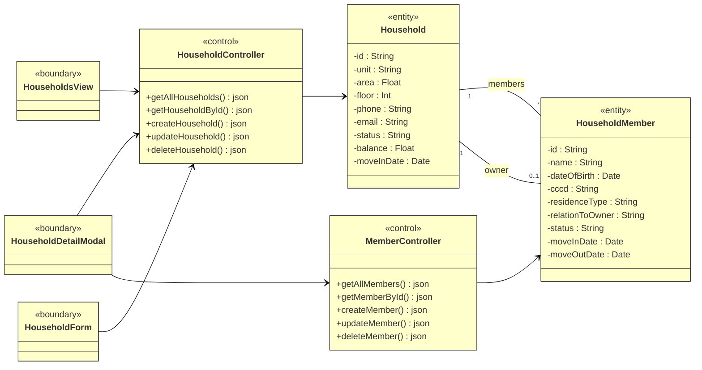

### 1.3 Sơ Đồ Lớp Phân Tích - Quản Lý Khoản Thu

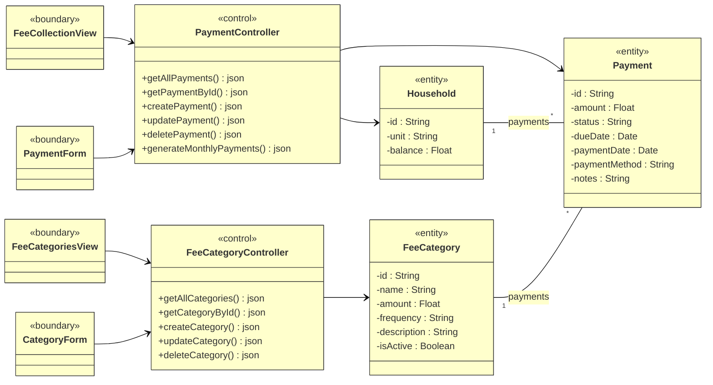

### 1.4 Sơ Đồ Lớp Phân Tích - Quản Lý Đỗ Xe

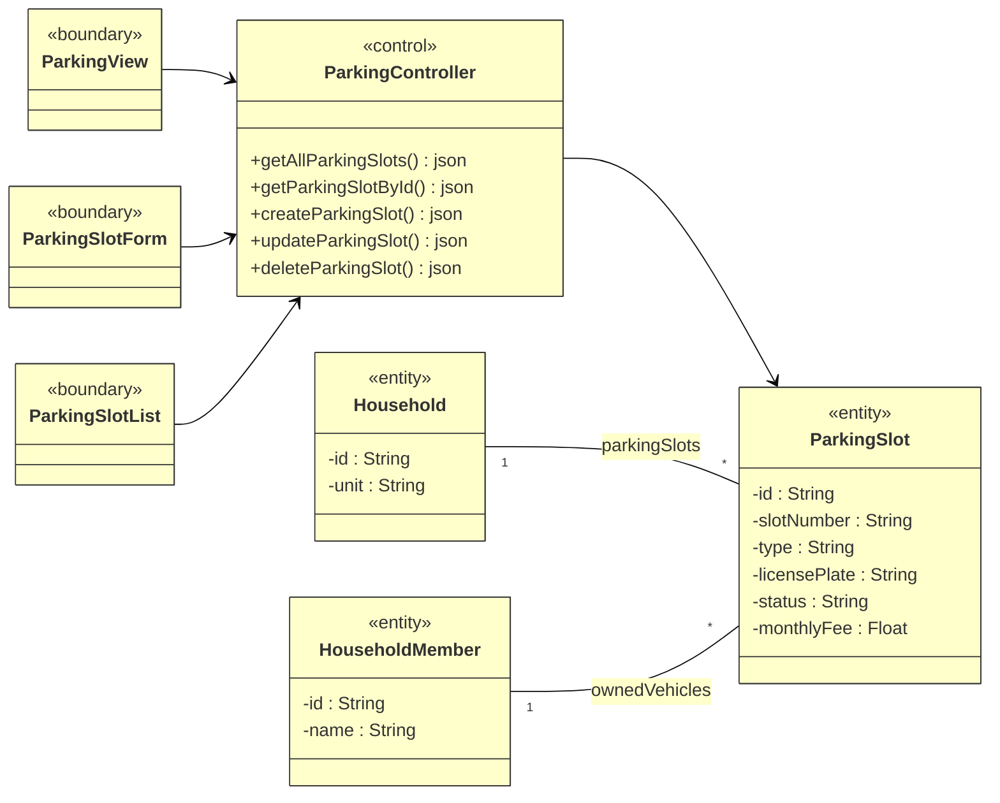

### 1.5 Sơ Đồ Lớp Phân Tích - Quản Lý Tiện Ích

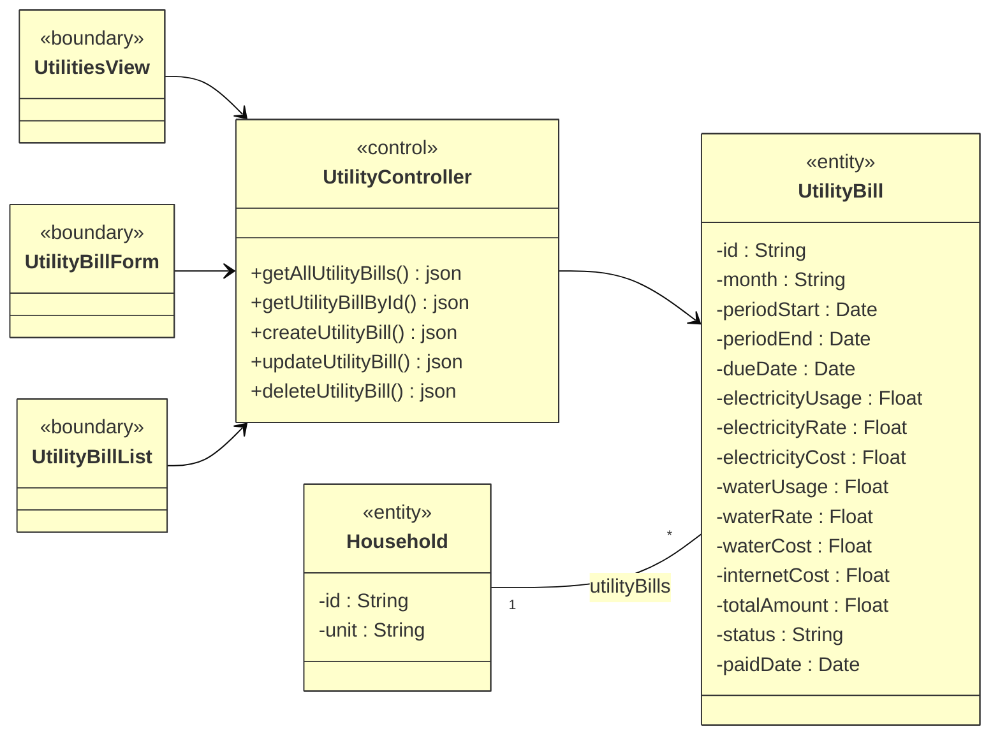

### 1.6 Sơ Đồ Lớp Phân Tích - Xác Thực & Quản Lý Người Dùng

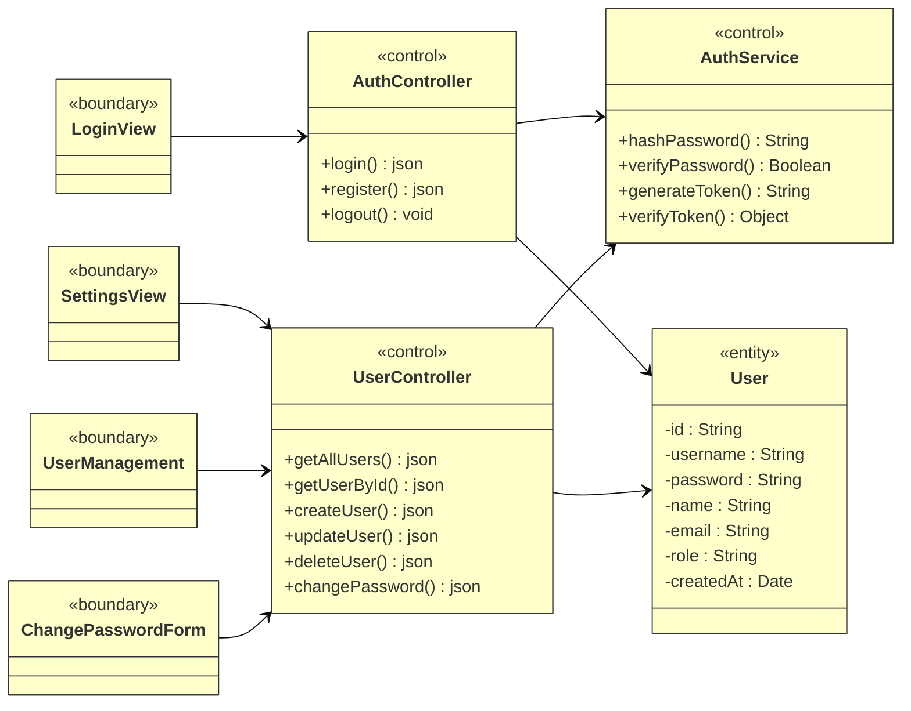

---

## 2. Sơ Đồ Lớp Chi Tiết

### 2.1 Sơ Đồ Lớp Chi Tiết - Tổng Quan Entity

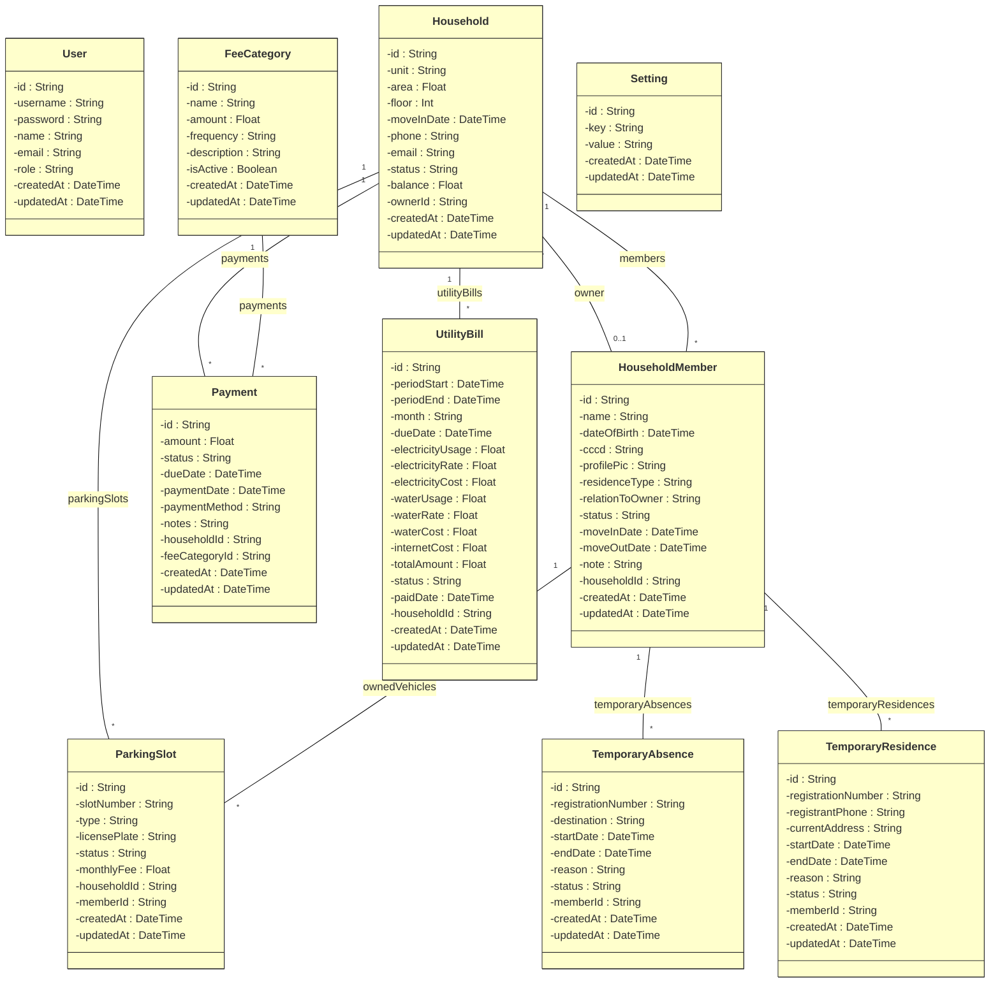

### 2.2 Sơ Đồ Lớp Chi Tiết - Quản Lý Khoản Thu (Full Stack)

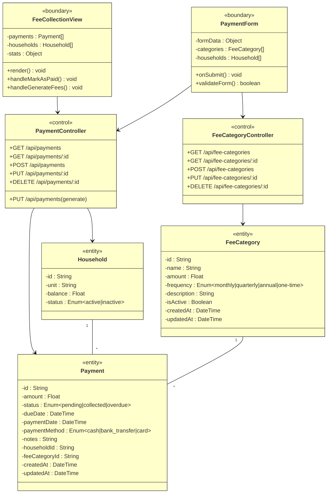

### 2.3 Sơ Đồ Lớp Chi Tiết - Quản Lý Hộ Gia Đình (Full Stack)

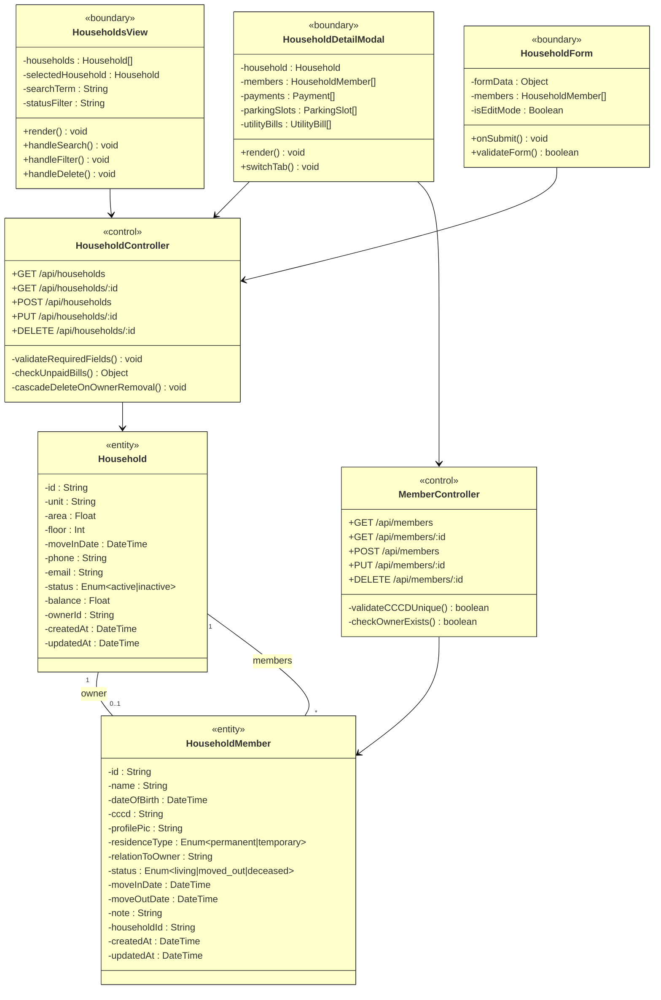

### 2.4 Sơ Đồ Lớp Chi Tiết - Quản Lý Đỗ Xe (Full Stack)

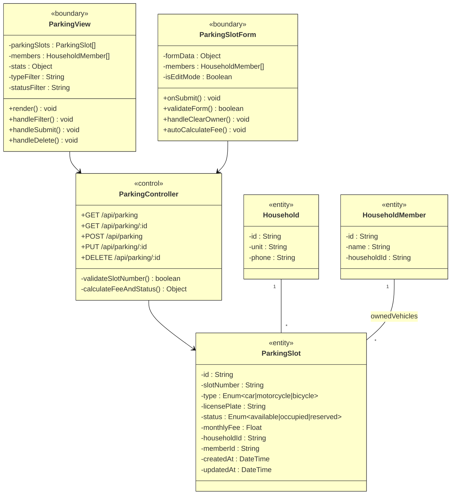

### 2.5 Sơ Đồ Lớp Chi Tiết - Xác Thực (Full Stack)

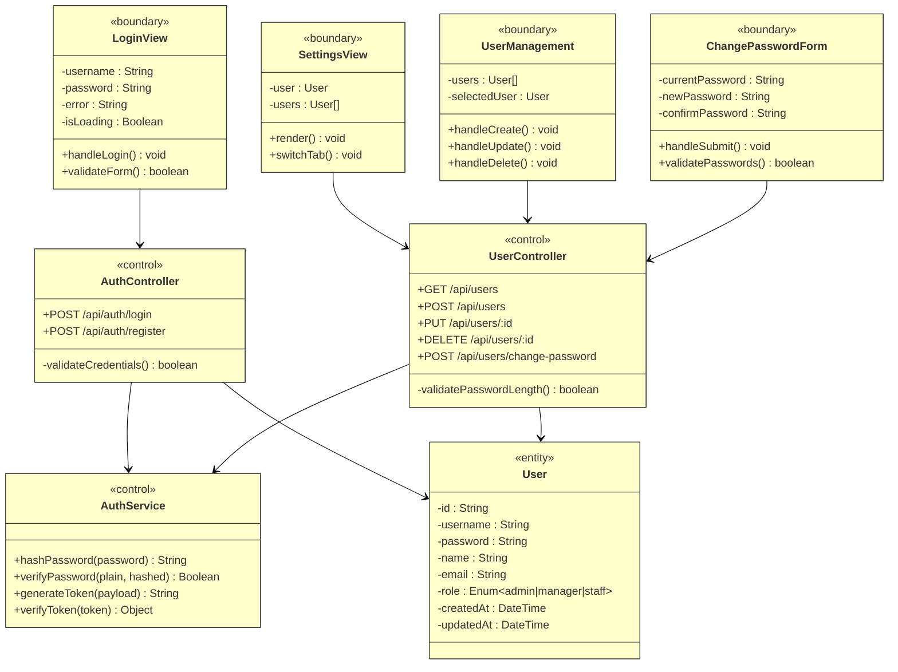

---

## 3. Chú Thích Ký Hiệu

| Ký hiệu | Mô tả |
|---------|-------|
| `<<boundary>>` | Lớp giao diện người dùng (Views, Forms, Components) |
| `<<control>>` | Lớp điều khiển (API Routes, Controllers, Services) |
| `<<entity>>` | Lớp thực thể dữ liệu (Database Models) |
| `--` | Quan hệ liên kết (Association) |
| `-->` | Quan hệ phụ thuộc (Dependency) |
| `"1" -- "*"` | Quan hệ một-nhiều |
| `"0..1"` | Quan hệ tùy chọn (0 hoặc 1) |

---

## 4. Ánh Xạ Code Thực Tế

| Lớp Phân Tích | File/Folder Thực Tế |
|---------------|---------------------|
| **Boundary Classes** | `components/` folder |
| HouseholdsView | `components/HouseholdsView.tsx` |
| FeeCollectionView | `components/FeeCollectionView.tsx` |
| ParkingView | `components/ParkingView.tsx` |
| UtilitiesView | `components/UtilitiesView.tsx` |
| LoginView | `components/Login.tsx` |
| **Control Classes** | `app/api/` folder |
| HouseholdController | `app/api/households/route.ts` |
| PaymentController | `app/api/payments/route.ts` |
| ParkingController | `app/api/parking/route.ts` |
| AuthController | `app/api/auth/login/route.ts` |
| **Entity Classes** | `prisma/schema.prisma` |
| Household | Prisma model Household |
| Payment | Prisma model Payment |
| ParkingSlot | Prisma model ParkingSlot |
