# Biểu Đồ Trình Tự - Hệ Thống Quản Lý Phí Chung Cư BlueMoon

## Mô Hình BCE (Boundary - Control - Entity)

- **Boundary (View)**: Giao diện người dùng - `<<Boundary>>`
- **Control (Controller)**: Xử lý logic nghiệp vụ - `<<Control>>`
- **Entity (Model)**: Cơ sở dữ liệu - `<<Entity>>`

## Tổng Quan Hệ Thống

Hệ thống quản lý phí chung cư BlueMoon bao gồm các nghiệp vụ chính:
1. **Xác thực (Authentication)** - Đăng nhập, Đăng ký
2. **Quản lý Hộ gia đình (Households)** - CRUD hộ gia đình
3. **Quản lý Cư dân (Members)** - CRUD thành viên hộ gia đình
4. **Quản lý Danh mục phí (Fee Categories)** - CRUD loại phí
5. **Thu phí (Payments)** - Tạo, thu phí, cập nhật trạng thái
6. **Quản lý Bãi đỗ xe (Parking)** - CRUD chỗ đỗ xe
7. **Quản lý Tiện ích (Utilities)** - Hóa đơn điện/nước/internet
8. **Thống kê (Statistics)** - Báo cáo tổng hợp

---

## 1. Nghiệp Vụ Xác Thực (Authentication)

### 1.1 Đăng Nhập (Login)

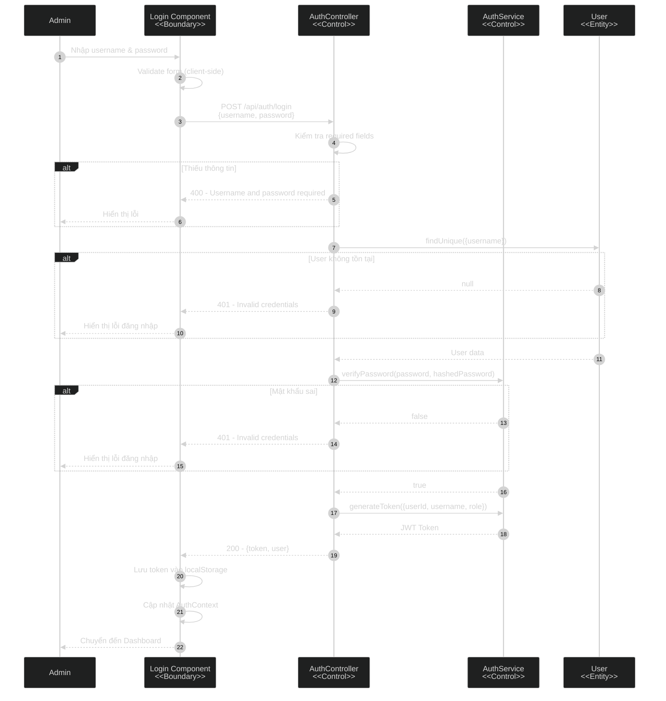
```mermaid
%%{init: {'theme': 'dark'}}%%
sequenceDiagram
    autonumber
    participant Admin as Admin
    participant View as Login Component<br/><<Boundary>>
    participant Controller as AuthController<br/><<Control>>
    participant AuthService as AuthService<br/><<Control>>
    participant Model as User<br/><<Entity>>
    
    Admin->>View: Nhập username & password
    View->>View: Validate form (client-side)
    View->>Controller: POST /api/auth/login<br/>{username, password}
    
    Controller->>Controller: Kiểm tra required fields
    alt Thiếu thông tin
        Controller-->>View: 400 - Username and password required
        View-->>Admin: Hiển thị lỗi
    end
    
    Controller->>Model: findUnique({username})
    
    alt User không tồn tại
        Model-->>Controller: null
        Controller-->>View: 401 - Invalid credentials
        View-->>Admin: Hiển thị lỗi đăng nhập
    end
    
    Model-->>Controller: User data
    Controller->>AuthService: verifyPassword(password, hashedPassword)
    
    alt Mật khẩu sai
        AuthService-->>Controller: false
        Controller-->>View: 401 - Invalid credentials
        View-->>Admin: Hiển thị lỗi đăng nhập
    end
    
    AuthService-->>Controller: true
    Controller->>AuthService: generateToken({userId, username, role})
    AuthService-->>Controller: JWT Token
    
    Controller-->>View: 200 - {token, user}
    View->>View: Lưu token vào localStorage
    View->>View: Cập nhật AuthContext
    View-->>Admin: Chuyển đến Dashboard
```

### 1.2 Đăng Ký (Register)

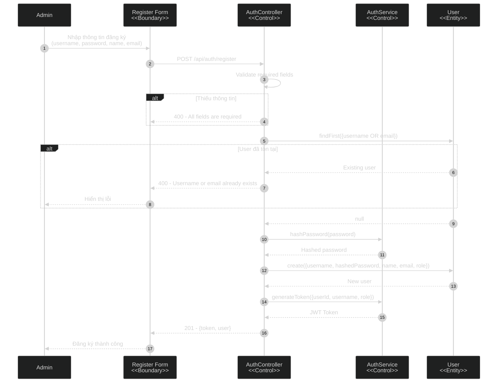
```mermaid
%%{init: {'theme': 'dark'}}%%
sequenceDiagram
    autonumber
    participant Admin as Admin
    participant View as Register Form<br/><<Boundary>>
    participant Controller as AuthController<br/><<Control>>
    participant AuthService as AuthService<br/><<Control>>
    participant Model as User<br/><<Entity>>
    
    Admin->>View: Nhập thông tin đăng ký<br/>(username, password, name, email)
    View->>Controller: POST /api/auth/register
    
    Controller->>Controller: Validate required fields
    alt Thiếu thông tin
        Controller-->>View: 400 - All fields are required
    end
    
    Controller->>Model: findFirst({username OR email})
    
    alt User đã tồn tại
        Model-->>Controller: Existing user
        Controller-->>View: 400 - Username or email already exists
        View-->>Admin: Hiển thị lỗi
    end
    
    Model-->>Controller: null
    Controller->>AuthService: hashPassword(password)
    AuthService-->>Controller: Hashed password
    
    Controller->>Model: create({username, hashedPassword, name, email, role})
    Model-->>Controller: New user
    
    Controller->>AuthService: generateToken({userId, username, role})
    AuthService-->>Controller: JWT Token
    
    Controller-->>View: 201 - {token, user}
    View-->>Admin: Đăng ký thành công
```

---

## 2. Nghiệp Vụ Quản Lý Hộ Gia Đình (Households)

### 2.1 Xem Danh Sách Hộ Gia Đình

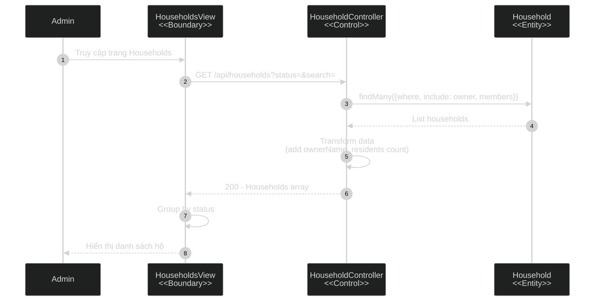
```mermaid
%%{init: {'theme': 'dark'}}%%
sequenceDiagram
    autonumber
    participant Admin as Admin
    participant View as HouseholdsView<br/><<Boundary>>
    participant Controller as HouseholdController<br/><<Control>>
    participant Model as Household<br/><<Entity>>
    
    Admin->>View: Truy cập trang Households
    View->>Controller: GET /api/households?status=&search=
    
    Controller->>Model: findMany({where, include: owner, members})
    Model-->>Controller: List households
    
    Controller->>Controller: Transform data<br/>(add ownerName, residents count)
    Controller-->>View: 200 - Households array
    
    View->>View: Group by status
    View-->>Admin: Hiển thị danh sách hộ
```

### 2.2 Tạo Hộ Gia Đình Mới

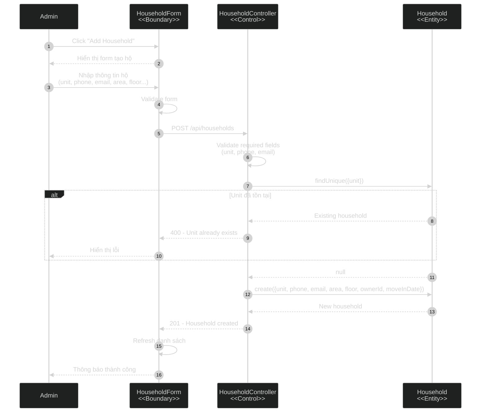
```mermaid
%%{init: {'theme': 'dark'}}%%
sequenceDiagram
    autonumber
    participant Admin as Admin
    participant View as HouseholdForm<br/><<Boundary>>
    participant Controller as HouseholdController<br/><<Control>>
    participant Model as Household<br/><<Entity>>
    
    Admin->>View: Click "Add Household"
    View-->>Admin: Hiển thị form tạo hộ
    
    Admin->>View: Nhập thông tin hộ<br/>(unit, phone, email, area, floor...)
    View->>View: Validate form
    
    View->>Controller: POST /api/households
    
    Controller->>Controller: Validate required fields<br/>(unit, phone, email)
    
    Controller->>Model: findUnique({unit})
    alt Unit đã tồn tại
        Model-->>Controller: Existing household
        Controller-->>View: 400 - Unit already exists
        View-->>Admin: Hiển thị lỗi
    end
    
    Model-->>Controller: null
    Controller->>Model: create({unit, phone, email, area, floor, ownerId, moveInDate})
    Model-->>Controller: New household
    
    Controller-->>View: 201 - Household created
    View->>View: Refresh danh sách
    View-->>Admin: Thông báo thành công
```

### 2.3 Xem Chi Tiết Hộ Gia Đình

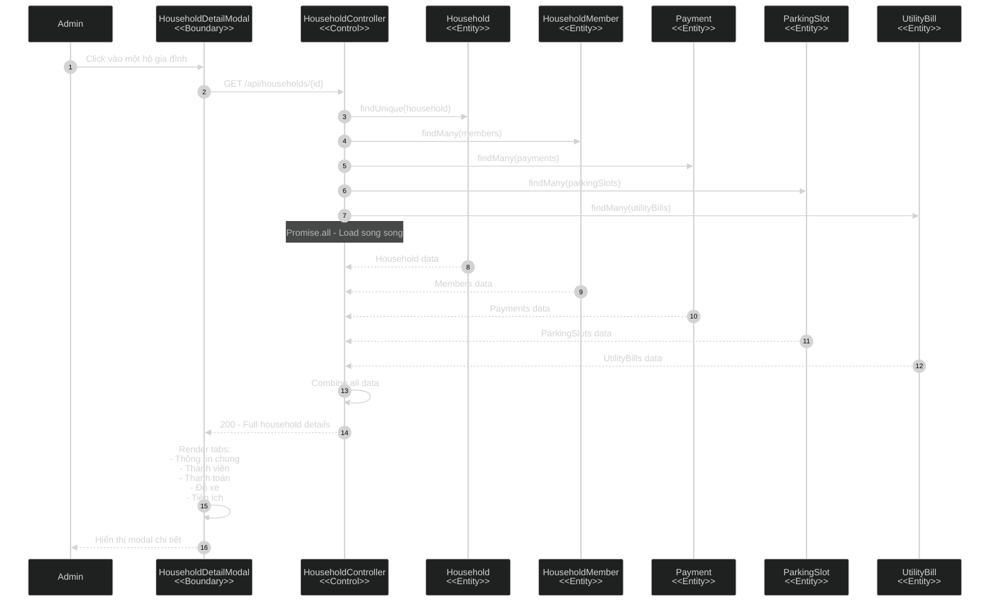
```mermaid
%%{init: {'theme': 'dark'}}%%
sequenceDiagram
    autonumber
    participant Admin as Admin
    participant View as HouseholdDetailModal<br/><<Boundary>>
    participant Controller as HouseholdController<br/><<Control>>
    participant HouseholdModel as Household<br/><<Entity>>
    participant MemberModel as HouseholdMember<br/><<Entity>>
    participant PaymentModel as Payment<br/><<Entity>>
    participant ParkingModel as ParkingSlot<br/><<Entity>>
    participant UtilityModel as UtilityBill<br/><<Entity>>
    
    Admin->>View: Click vào một hộ gia đình
    View->>Controller: GET /api/households/{id}
    
    Controller->>HouseholdModel: findUnique(household)
    Controller->>MemberModel: findMany(members)
    Controller->>PaymentModel: findMany(payments)
    Controller->>ParkingModel: findMany(parkingSlots)
    Controller->>UtilityModel: findMany(utilityBills)
    
    Note over Controller: Promise.all - Load song song
    
    HouseholdModel-->>Controller: Household data
    MemberModel-->>Controller: Members data
    PaymentModel-->>Controller: Payments data
    ParkingModel-->>Controller: ParkingSlots data
    UtilityModel-->>Controller: UtilityBills data
    
    Controller->>Controller: Combine all data
    Controller-->>View: 200 - Full household details
    
    View->>View: Render tabs:<br/>- Thông tin chung<br/>- Thành viên<br/>- Thanh toán<br/>- Đỗ xe<br/>- Tiện ích
    View-->>Admin: Hiển thị modal chi tiết
```

### 2.4 Cập Nhật Hộ Gia Đình

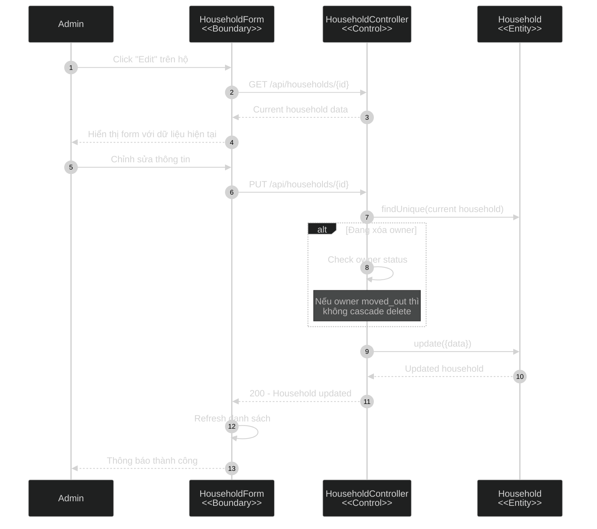
```mermaid
%%{init: {'theme': 'dark'}}%%
sequenceDiagram
    autonumber
    participant Admin as Admin
    participant View as HouseholdForm<br/><<Boundary>>
    participant Controller as HouseholdController<br/><<Control>>
    participant Model as Household<br/><<Entity>>
    
    Admin->>View: Click "Edit" trên hộ
    View->>Controller: GET /api/households/{id}
    Controller-->>View: Current household data
    View-->>Admin: Hiển thị form với dữ liệu hiện tại
    
    Admin->>View: Chỉnh sửa thông tin
    View->>Controller: PUT /api/households/{id}
    
    Controller->>Model: findUnique(current household)
    
    alt Đang xóa owner
        Controller->>Controller: Check owner status
        Note over Controller: Nếu owner moved_out thì<br/>không cascade delete
    end
    
    Controller->>Model: update({data})
    Model-->>Controller: Updated household
    
    Controller-->>View: 200 - Household updated
    View->>View: Refresh danh sách
    View-->>Admin: Thông báo thành công
```

### 2.5 Xóa Hộ Gia Đình

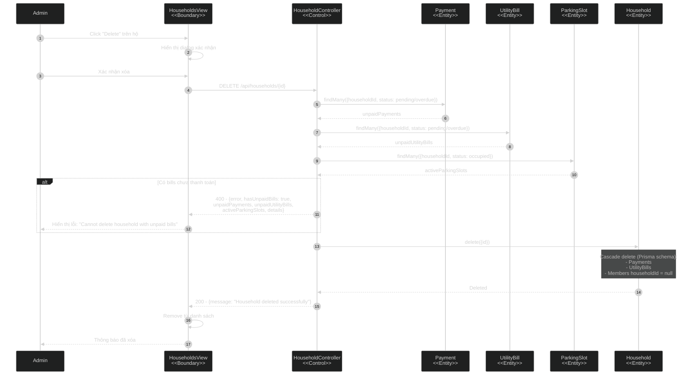
```mermaid
%%{init: {'theme': 'dark'}}%%
sequenceDiagram
    autonumber
    participant Admin as Admin
    participant View as HouseholdsView<br/><<Boundary>>
    participant Controller as HouseholdController<br/><<Control>>
    participant PaymentModel as Payment<br/><<Entity>>
    participant UtilityModel as UtilityBill<br/><<Entity>>
    participant ParkingModel as ParkingSlot<br/><<Entity>>
    participant HouseholdModel as Household<br/><<Entity>>
    
    Admin->>View: Click "Delete" trên hộ
    View->>View: Hiển thị dialog xác nhận
    Admin->>View: Xác nhận xóa
    
    View->>Controller: DELETE /api/households/{id}
    
    Controller->>PaymentModel: findMany({householdId, status: pending/overdue})
    PaymentModel-->>Controller: unpaidPayments
    
    Controller->>UtilityModel: findMany({householdId, status: pending/overdue})
    UtilityModel-->>Controller: unpaidUtilityBills
    
    Controller->>ParkingModel: findMany({householdId, status: occupied})
    ParkingModel-->>Controller: activeParkingSlots
    
    alt Có bills chưa thanh toán
        Controller-->>View: 400 - {error, hasUnpaidBills: true,<br/>unpaidPayments, unpaidUtilityBills,<br/>activeParkingSlots, details}
        View-->>Admin: Hiển thị lỗi: "Cannot delete household with unpaid bills"
    end
    
    Controller->>HouseholdModel: delete({id})
    Note over HouseholdModel: Cascade delete (Prisma schema):<br/>- Payments<br/>- UtilityBills<br/>- Members householdId = null
    
    HouseholdModel-->>Controller: Deleted
    Controller-->>View: 200 - {message: "Household deleted successfully"}
    
    View->>View: Remove từ danh sách
    View-->>Admin: Thông báo đã xóa
```

---

## 3. Nghiệp Vụ Quản Lý Cư Dân (Members)

### 3.1 Thêm Thành Viên Mới

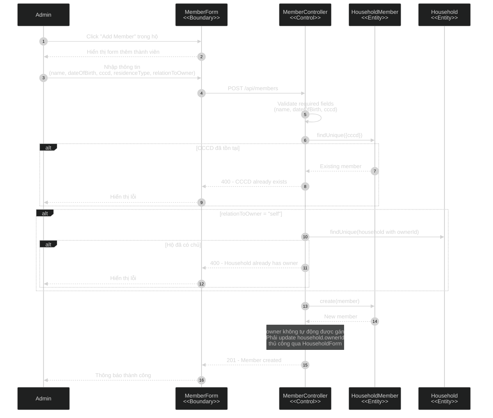
```mermaid
%%{init: {'theme': 'dark'}}%%
sequenceDiagram
    autonumber
    participant Admin as Admin
    participant View as MemberForm<br/><<Boundary>>
    participant Controller as MemberController<br/><<Control>>
    participant MemberModel as HouseholdMember<br/><<Entity>>
    participant HouseholdModel as Household<br/><<Entity>>
    
    Admin->>View: Click "Add Member" trong hộ
    View-->>Admin: Hiển thị form thêm thành viên
    
    Admin->>View: Nhập thông tin<br/>(name, dateOfBirth, cccd, residenceType, relationToOwner)
    View->>Controller: POST /api/members
    
    Controller->>Controller: Validate required fields<br/>(name, dateOfBirth, cccd)
    
    Controller->>MemberModel: findUnique({cccd})
    alt CCCD đã tồn tại
        MemberModel-->>Controller: Existing member
        Controller-->>View: 400 - CCCD already exists
        View-->>Admin: Hiển thị lỗi
    end
    
    alt relationToOwner = "self"
        Controller->>HouseholdModel: findUnique(household with ownerId)
        alt Hộ đã có chủ
            Controller-->>View: 400 - Household already has owner
            View-->>Admin: Hiển thị lỗi
        end
    end
    
    Controller->>MemberModel: create(member)
    MemberModel-->>Controller: New member
    
    Note over Controller: owner không tự động được gán<br/>Phải update household.ownerId<br/>thủ công qua HouseholdForm
    
    Controller-->>View: 201 - Member created
    View-->>Admin: Thông báo thành công
```

### 3.2 Cập Nhật Thành Viên

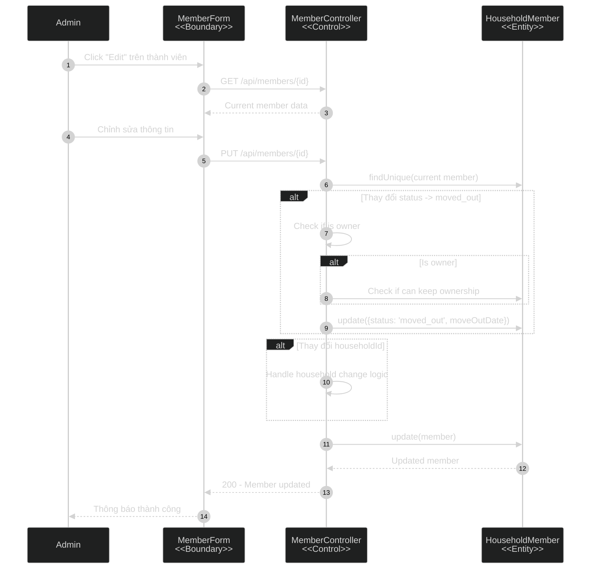
```mermaid
%%{init: {'theme': 'dark'}}%%
sequenceDiagram
    autonumber
    participant Admin as Admin
    participant View as MemberForm<br/><<Boundary>>
    participant Controller as MemberController<br/><<Control>>
    participant Model as HouseholdMember<br/><<Entity>>
    
    Admin->>View: Click "Edit" trên thành viên
    View->>Controller: GET /api/members/{id}
    Controller-->>View: Current member data
    
    Admin->>View: Chỉnh sửa thông tin
    View->>Controller: PUT /api/members/{id}
    
    Controller->>Model: findUnique(current member)
    
    alt Thay đổi status -> moved_out
        Controller->>Controller: Check if is owner
        alt Is owner
            Controller->>Model: Check if can keep ownership
        end
        Controller->>Model: update({status: 'moved_out', moveOutDate})
    end
    
    alt Thay đổi householdId
        Controller->>Controller: Handle household change logic
    end
    
    Controller->>Model: update(member)
    Model-->>Controller: Updated member
    
    Controller-->>View: 200 - Member updated
    View-->>Admin: Thông báo thành công
```

---

## 4. Nghiệp Vụ Quản Lý Danh Mục Phí (Fee Categories)

### 4.1 Tạo Danh Mục Phí

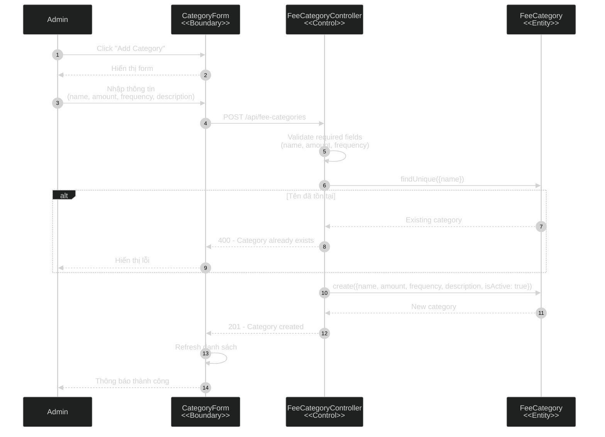
```mermaid
%%{init: {'theme': 'dark'}}%%
sequenceDiagram
    autonumber
    participant Admin as Admin
    participant View as CategoryForm<br/><<Boundary>>
    participant Controller as FeeCategoryController<br/><<Control>>
    participant Model as FeeCategory<br/><<Entity>>
    
    Admin->>View: Click "Add Category"
    View-->>Admin: Hiển thị form
    
    Admin->>View: Nhập thông tin<br/>(name, amount, frequency, description)
    View->>Controller: POST /api/fee-categories
    
    Controller->>Controller: Validate required fields<br/>(name, amount, frequency)
    
    Controller->>Model: findUnique({name})
    alt Tên đã tồn tại
        Model-->>Controller: Existing category
        Controller-->>View: 400 - Category already exists
        View-->>Admin: Hiển thị lỗi
    end
    
    Controller->>Model: create({name, amount, frequency, description, isActive: true})
    Model-->>Controller: New category
    
    Controller-->>View: 201 - Category created
    View->>View: Refresh danh sách
    View-->>Admin: Thông báo thành công
```

### 4.2 Xem Danh Sách Danh Mục Phí

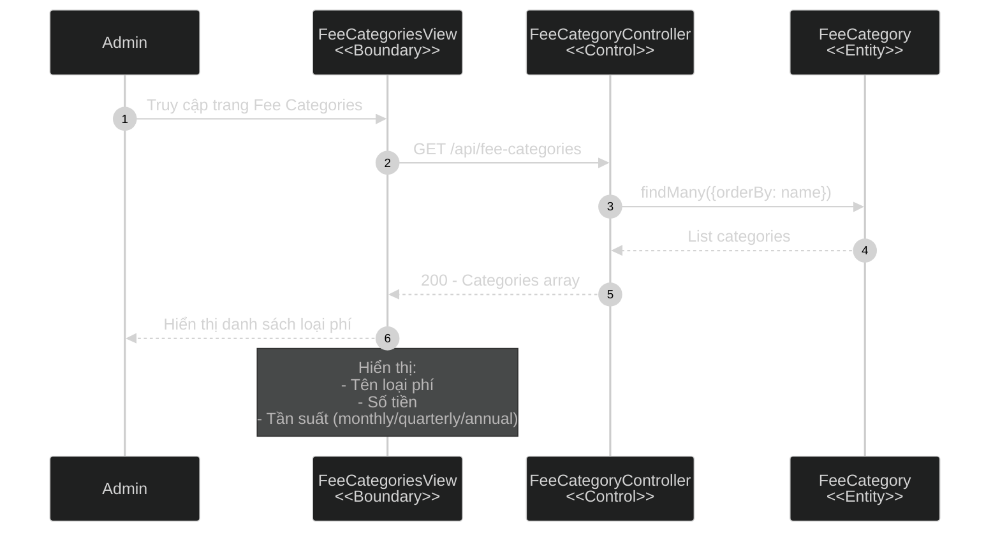
```mermaid
%%{init: {'theme': 'dark'}}%%
sequenceDiagram
    autonumber
    participant Admin as Admin
    participant View as FeeCategoriesView<br/><<Boundary>>
    participant Controller as FeeCategoryController<br/><<Control>>
    participant Model as FeeCategory<br/><<Entity>>
    
    Admin->>View: Truy cập trang Fee Categories
    View->>Controller: GET /api/fee-categories
    
    Controller->>Model: findMany({orderBy: name})
    Model-->>Controller: List categories
    
    Controller-->>View: 200 - Categories array
    View-->>Admin: Hiển thị danh sách loại phí
    
    Note over View: Hiển thị:<br/>- Tên loại phí<br/>- Số tiền<br/>- Tần suất (monthly/quarterly/annual)
```

---

## 5. Nghiệp Vụ Thu Phí (Payments)

### 5.1 Xem Danh Sách Thanh Toán

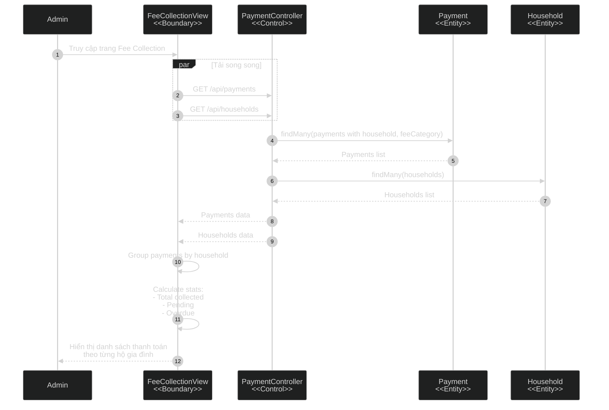
```mermaid
%%{init: {'theme': 'dark'}}%%
sequenceDiagram
    autonumber
    participant Admin as Admin
    participant View as FeeCollectionView<br/><<Boundary>>
    participant Controller as PaymentController<br/><<Control>>
    participant PaymentModel as Payment<br/><<Entity>>
    participant HouseholdModel as Household<br/><<Entity>>
    
    Admin->>View: Truy cập trang Fee Collection
    
    par Tải song song
        View->>Controller: GET /api/payments
        View->>Controller: GET /api/households
    end
    
    Controller->>PaymentModel: findMany(payments with household, feeCategory)
    PaymentModel-->>Controller: Payments list
    
    Controller->>HouseholdModel: findMany(households)
    HouseholdModel-->>Controller: Households list
    
    Controller-->>View: Payments data
    Controller-->>View: Households data
    
    View->>View: Group payments by household
    View->>View: Calculate stats:<br/>- Total collected<br/>- Pending<br/>- Overdue
    
    View-->>Admin: Hiển thị danh sách thanh toán<br/>theo từng hộ gia đình
```

### 5.2 Tạo Khoản Thu Phí Mới

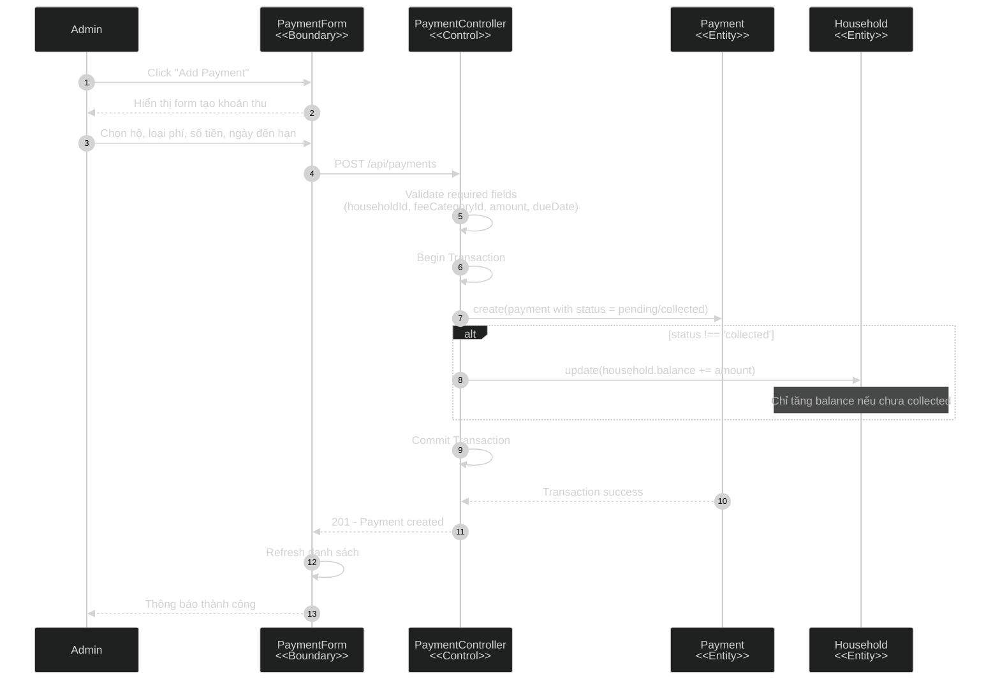
```mermaid
%%{init: {'theme': 'dark'}}%%
sequenceDiagram
    autonumber
    participant Admin as Admin
    participant View as PaymentForm<br/><<Boundary>>
    participant Controller as PaymentController<br/><<Control>>
    participant PaymentModel as Payment<br/><<Entity>>
    participant HouseholdModel as Household<br/><<Entity>>
    
    Admin->>View: Click "Add Payment"
    View-->>Admin: Hiển thị form tạo khoản thu
    
    Admin->>View: Chọn hộ, loại phí, số tiền, ngày đến hạn
    View->>Controller: POST /api/payments
    
    Controller->>Controller: Validate required fields<br/>(householdId, feeCategoryId, amount, dueDate)
    
    Controller->>Controller: Begin Transaction
    Controller->>PaymentModel: create(payment with status = pending/collected)
    
    alt status !== 'collected'
        Controller->>HouseholdModel: update(household.balance += amount)
        Note over HouseholdModel: Chỉ tăng balance nếu chưa collected
    end
    
    Controller->>Controller: Commit Transaction
    
    PaymentModel-->>Controller: Transaction success
    Controller-->>View: 201 - Payment created
    
    View->>View: Refresh danh sách
    View-->>Admin: Thông báo thành công
```

### 5.3 Thu Phí (Mark as Paid)

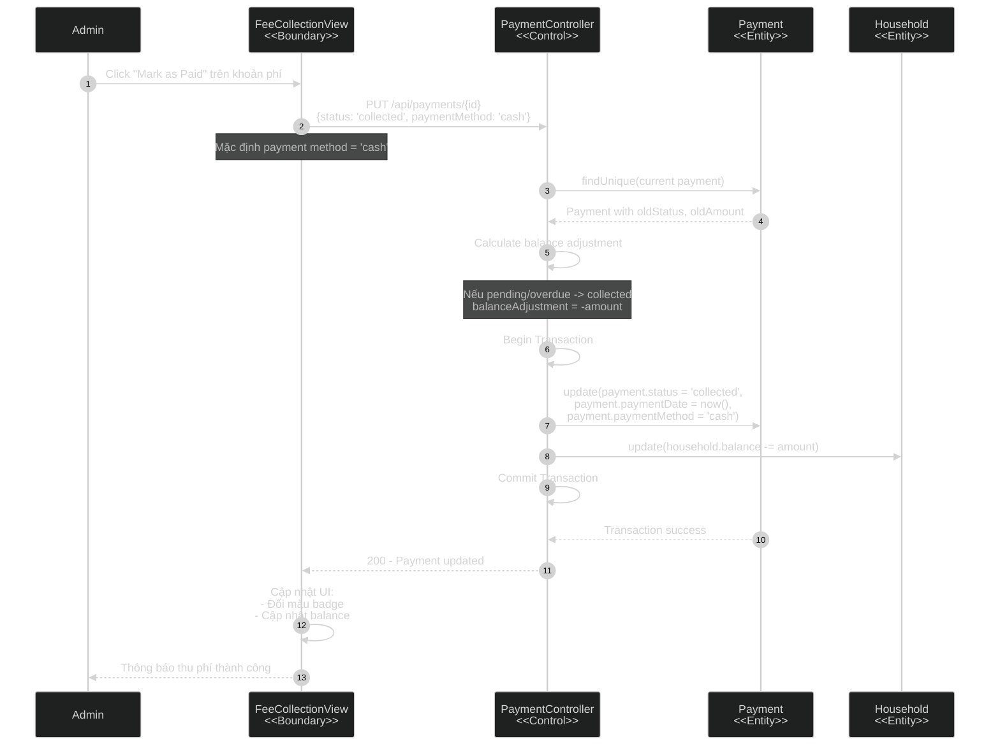
```mermaid
%%{init: {'theme': 'dark'}}%%
sequenceDiagram
    autonumber
    participant Admin as Admin
    participant View as FeeCollectionView<br/><<Boundary>>
    participant Controller as PaymentController<br/><<Control>>
    participant PaymentModel as Payment<br/><<Entity>>
    participant HouseholdModel as Household<br/><<Entity>>
    
    Admin->>View: Click "Mark as Paid" trên khoản phí
    
    View->>Controller: PUT /api/payments/{id}<br/>{status: 'collected', paymentMethod: 'cash'}
    Note over View: Mặc định payment method = 'cash'
    
    Controller->>PaymentModel: findUnique(current payment)
    PaymentModel-->>Controller: Payment with oldStatus, oldAmount
    
    Controller->>Controller: Calculate balance adjustment
    Note over Controller: Nếu pending/overdue -> collected<br/>balanceAdjustment = -amount
    
    Controller->>Controller: Begin Transaction
    Controller->>PaymentModel: update(payment.status = 'collected',<br/>payment.paymentDate = now(),<br/>payment.paymentMethod = 'cash')
    Controller->>HouseholdModel: update(household.balance -= amount)
    Controller->>Controller: Commit Transaction
    
    PaymentModel-->>Controller: Transaction success
    Controller-->>View: 200 - Payment updated
    
    View->>View: Cập nhật UI:<br/>- Đổi màu badge<br/>- Cập nhật balance
    View-->>Admin: Thông báo thu phí thành công
```

Note: Phương thức thanh toán có thể thay đổi khi chỉnh sửa payment qua PaymentForm.

### 5.4 Tạo Phí Hàng Tháng Cho Tất Cả Hộ

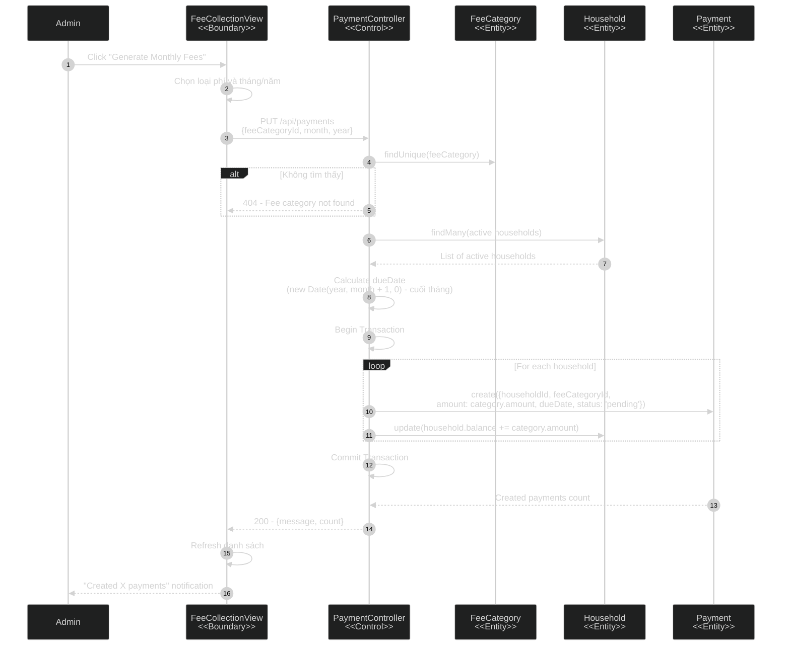
```mermaid
%%{init: {'theme': 'dark'}}%%
sequenceDiagram
    autonumber
    participant Admin as Admin
    participant View as FeeCollectionView<br/><<Boundary>>
    participant Controller as PaymentController<br/><<Control>>
    participant CategoryModel as FeeCategory<br/><<Entity>>
    participant HouseholdModel as Household<br/><<Entity>>
    participant PaymentModel as Payment<br/><<Entity>>
    
    Admin->>View: Click "Generate Monthly Fees"
    View->>View: Chọn loại phí và tháng/năm
    
    View->>Controller: PUT /api/payments<br/>{feeCategoryId, month, year}
    
    Controller->>CategoryModel: findUnique(feeCategory)
    alt Không tìm thấy
        Controller-->>View: 404 - Fee category not found
    end
    
    Controller->>HouseholdModel: findMany(active households)
    HouseholdModel-->>Controller: List of active households
    
    Controller->>Controller: Calculate dueDate<br/>(new Date(year, month + 1, 0) - cuối tháng)
    
    Controller->>Controller: Begin Transaction
    loop For each household
        Controller->>PaymentModel: create({householdId, feeCategoryId,<br/>amount: category.amount, dueDate, status: 'pending'})
        Controller->>HouseholdModel: update(household.balance += category.amount)
    end
    Controller->>Controller: Commit Transaction
    
    PaymentModel-->>Controller: Created payments count
    Controller-->>View: 200 - {message, count}
    
    View->>View: Refresh danh sách
    View-->>Admin: "Created X payments" notification
```

---

## 6. Nghiệp Vụ Quản Lý Bãi Đỗ Xe (Parking)

### 6.1 Đăng Ký Chỗ Đỗ Xe

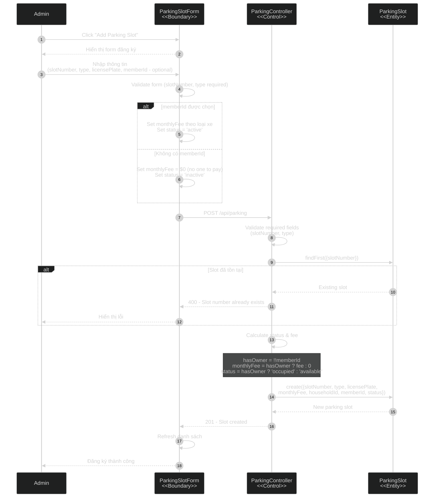
```mermaid
%%{init: {'theme': 'dark'}}%%
sequenceDiagram
    autonumber
    participant Admin as Admin
    participant View as ParkingSlotForm<br/><<Boundary>>
    participant Controller as ParkingController<br/><<Control>>
    participant Model as ParkingSlot<br/><<Entity>>
    
    Admin->>View: Click "Add Parking Slot"
    View-->>Admin: Hiển thị form đăng ký
    
    Admin->>View: Nhập thông tin<br/>(slotNumber, type, licensePlate, memberId - optional)
    View->>View: Validate form (slotNumber, type required)
    
    alt memberId được chọn
        View->>View: Set monthlyFee theo loại xe<br/>Set status = 'active'
    else Không có memberId
        View->>View: Set monthlyFee = $0 (no one to pay)<br/>Set status = 'inactive'
    end
    
    View->>Controller: POST /api/parking
    
    Controller->>Controller: Validate required fields<br/>(slotNumber, type)
    
    Controller->>Model: findFirst({slotNumber})
    alt Slot đã tồn tại
        Model-->>Controller: Existing slot
        Controller-->>View: 400 - Slot number already exists
        View-->>Admin: Hiển thị lỗi
    end
    
    Controller->>Controller: Calculate status & fee
    Note over Controller: hasOwner = !!memberId<br/>monthlyFee = hasOwner ? fee : 0<br/>status = hasOwner ? 'occupied' : 'available'
    
    Controller->>Model: create({slotNumber, type, licensePlate,<br/>monthlyFee, householdId, memberId, status})
    Model-->>Controller: New parking slot
    
    Controller-->>View: 201 - Slot created
    View->>View: Refresh danh sách
    View-->>Admin: Đăng ký thành công
```

### 6.2 Xem Danh Sách Chỗ Đỗ

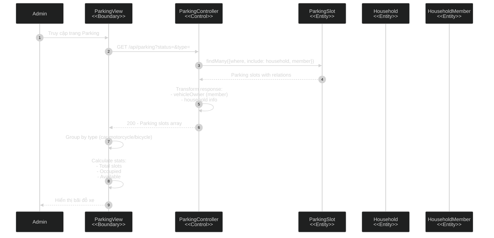
```mermaid
%%{init: {'theme': 'dark'}}%%
sequenceDiagram
    autonumber
    participant Admin as Admin
    participant View as ParkingView<br/><<Boundary>>
    participant Controller as ParkingController<br/><<Control>>
    participant ParkingModel as ParkingSlot<br/><<Entity>>
    participant HouseholdModel as Household<br/><<Entity>>
    participant MemberModel as HouseholdMember<br/><<Entity>>
    
    Admin->>View: Truy cập trang Parking
    View->>Controller: GET /api/parking?status=&type=
    
    Controller->>ParkingModel: findMany({where, include: household, member})
    ParkingModel-->>Controller: Parking slots with relations
    
    Controller->>Controller: Transform response:<br/>- vehicleOwner (member)<br/>- household info
    
    Controller-->>View: 200 - Parking slots array
    
    View->>View: Group by type (car/motorcycle/bicycle)
    View->>View: Calculate stats:<br/>- Total slots<br/>- Occupied<br/>- Available
    
    View-->>Admin: Hiển thị bãi đỗ xe
```

### 6.3 Cập Nhật Chỗ Đỗ Xe

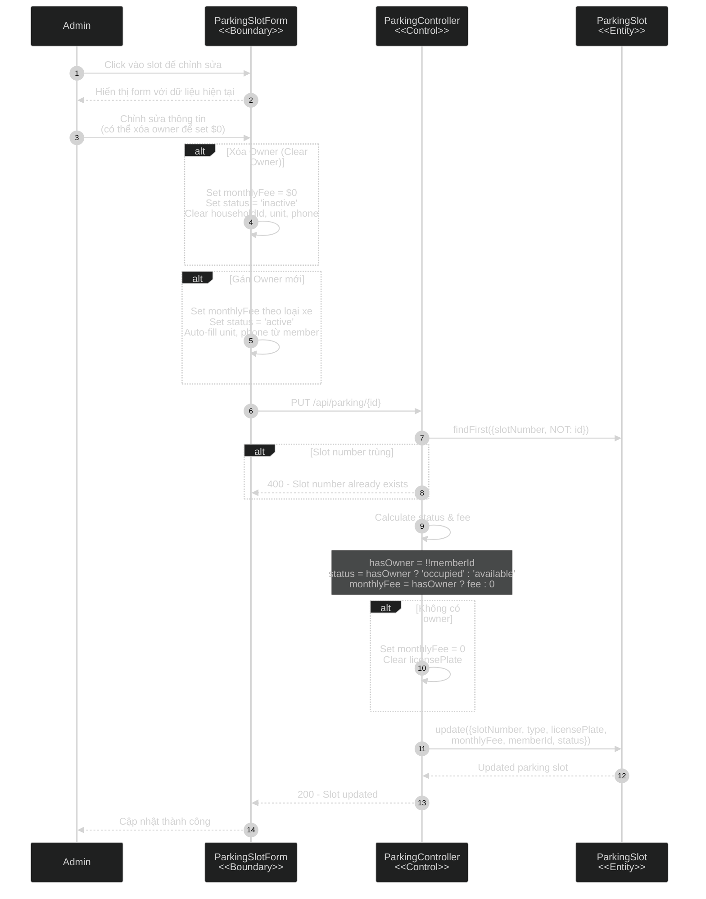
```mermaid
%%{init: {'theme': 'dark'}}%%
sequenceDiagram
    autonumber
    participant Admin as Admin
    participant View as ParkingSlotForm<br/><<Boundary>>
    participant Controller as ParkingController<br/><<Control>>
    participant Model as ParkingSlot<br/><<Entity>>
    
    Admin->>View: Click vào slot để chỉnh sửa
    View-->>Admin: Hiển thị form với dữ liệu hiện tại
    
    Admin->>View: Chỉnh sửa thông tin<br/>(có thể xóa owner để set $0)
    
    alt Xóa Owner (Clear Owner)
        View->>View: Set monthlyFee = $0<br/>Set status = 'inactive'<br/>Clear householdId, unit, phone
    end
    
    alt Gán Owner mới
        View->>View: Set monthlyFee theo loại xe<br/>Set status = 'active'<br/>Auto-fill unit, phone từ member
    end
    
    View->>Controller: PUT /api/parking/{id}
    
    Controller->>Model: findFirst({slotNumber, NOT: id})
    alt Slot number trùng
        Controller-->>View: 400 - Slot number already exists
    end
    
    Controller->>Controller: Calculate status & fee
    Note over Controller: hasOwner = !!memberId<br/>status = hasOwner ? 'occupied' : 'available'<br/>monthlyFee = hasOwner ? fee : 0
    
    alt Không có owner
        Controller->>Controller: Set monthlyFee = 0<br/>Clear licensePlate
    end
    
    Controller->>Model: update({slotNumber, type, licensePlate,<br/>monthlyFee, memberId, status})
    Model-->>Controller: Updated parking slot
    
    Controller-->>View: 200 - Slot updated
    View-->>Admin: Cập nhật thành công
```

---

## 7. Nghiệp Vụ Quản Lý Tiện Ích (Utilities)

### 7.1 Tạo Hóa Đơn Tiện Ích

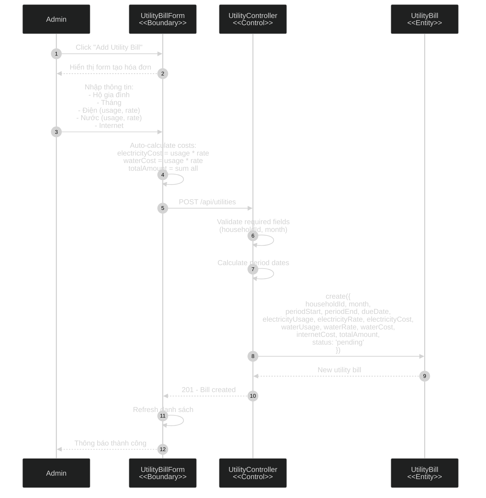
```mermaid
%%{init: {'theme': 'dark'}}%%
sequenceDiagram
    autonumber
    participant Admin as Admin
    participant View as UtilityBillForm<br/><<Boundary>>
    participant Controller as UtilityController<br/><<Control>>
    participant Model as UtilityBill<br/><<Entity>>
    
    Admin->>View: Click "Add Utility Bill"
    View-->>Admin: Hiển thị form tạo hóa đơn
    
    Admin->>View: Nhập thông tin:<br/>- Hộ gia đình<br/>- Tháng<br/>- Điện (usage, rate)<br/>- Nước (usage, rate)<br/>- Internet
    
    View->>View: Auto-calculate costs:<br/>electricityCost = usage * rate<br/>waterCost = usage * rate<br/>totalAmount = sum all
    
    View->>Controller: POST /api/utilities
    
    Controller->>Controller: Validate required fields<br/>(householdId, month)
    Controller->>Controller: Calculate period dates
    
    Controller->>Model: create({<br/>  householdId, month,<br/>  periodStart, periodEnd, dueDate,<br/>  electricityUsage, electricityRate, electricityCost,<br/>  waterUsage, waterRate, waterCost,<br/>  internetCost, totalAmount,<br/>  status: 'pending'<br/>})
    
    Model-->>Controller: New utility bill
    Controller-->>View: 201 - Bill created
    
    View->>View: Refresh danh sách
    View-->>Admin: Thông báo thành công
```

### 7.2 Thanh Toán Hóa Đơn Tiện Ích

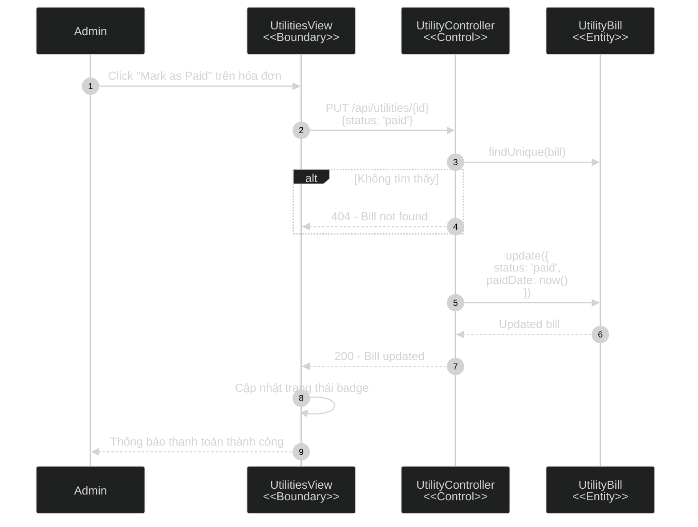
```mermaid
%%{init: {'theme': 'dark'}}%%
sequenceDiagram
    autonumber
    participant Admin as Admin
    participant View as UtilitiesView<br/><<Boundary>>
    participant Controller as UtilityController<br/><<Control>>
    participant Model as UtilityBill<br/><<Entity>>
    
    Admin->>View: Click "Mark as Paid" trên hóa đơn
    View->>Controller: PUT /api/utilities/{id}<br/>{status: 'paid'}
    
    Controller->>Model: findUnique(bill)
    alt Không tìm thấy
        Controller-->>View: 404 - Bill not found
    end
    
    Controller->>Model: update({<br/>  status: 'paid',<br/>  paidDate: now()<br/>})
    
    Model-->>Controller: Updated bill
    Controller-->>View: 200 - Bill updated
    
    View->>View: Cập nhật trạng thái badge
    View-->>Admin: Thông báo thanh toán thành công
```

---

## 8. Nghiệp Vụ Thống Kê (Statistics)

### 8.1 Xem Thống Kê Tổng Hợp

```mermaid
%%{init: {'theme': 'dark'}}%%
sequenceDiagram
    autonumber
    participant Admin as Admin
    participant View as StatisticsView<br/><<Boundary>>
    participant Controller as StatisticsController<br/><<Control>>
    participant HouseholdModel as Household<br/><<Entity>>
    participant MemberModel as HouseholdMember<br/><<Entity>>
    participant PaymentModel as Payment<br/><<Entity>>
    participant ParkingModel as ParkingSlot<br/><<Entity>>
    participant UtilityModel as UtilityBill<br/><<Entity>>
    participant CategoryModel as FeeCategory<br/><<Entity>>
    
    Admin->>View: Truy cập trang Statistics
    View->>View: Hiển thị loading state
    
    View->>Controller: GET /api/statistics
    
    Controller->>HouseholdModel: count(households)
    Controller->>MemberModel: count(residents)
    Controller->>PaymentModel: count & aggregate(payments by status)
    Controller->>ParkingModel: count & aggregate(parkingSlots)
    Controller->>UtilityModel: count & aggregate(utilityBills by status)
    Controller->>CategoryModel: findMany(category distribution)
    
    Note over Controller: Promise.all - 25+ queries chạy song song
    
    HouseholdModel-->>Controller: Household stats
    MemberModel-->>Controller: Member stats
    PaymentModel-->>Controller: Payment stats
    ParkingModel-->>Controller: Parking stats
    UtilityModel-->>Controller: Utility stats
    CategoryModel-->>Controller: Category stats
    
    Controller->>Controller: Calculate:<br/>- Monthly revenue<br/>- Collection rate<br/>- Category distribution<br/>- Parking stats
    
    Controller-->>View: 200 - Statistics object
    
    View->>View: Render charts:<br/>- Monthly Revenue Chart<br/>- Collection Rate Chart<br/>- Category Distribution Chart
    
    View-->>Admin: Hiển thị dashboard thống kê
```

---

## 9. Nghiệp Vụ Quản Lý Người Dùng (Users)

### 9.1 Tạo Người Dùng Mới

```mermaid
%%{init: {'theme': 'dark'}}%%
sequenceDiagram
    autonumber
    participant Admin as Admin
    participant View as UserManagement<br/><<Boundary>>
    participant Controller as UserController<br/><<Control>>
    participant AuthService as AuthService<br/><<Control>>
    participant Model as User<br/><<Entity>>
    
    Admin->>View: Click "Add User"
    View-->>Admin: Hiển thị form tạo user
    
    Admin->>View: Nhập thông tin<br/>(username, password, name, email, role)
    View->>Controller: POST /api/users
    
    Controller->>Controller: Validate required fields<br/>(username, password, name, email)
    
    Controller->>Model: findFirst({username OR email})
    alt Đã tồn tại
        Model-->>Controller: Existing user
        Controller-->>View: 400 - Username/Email already exists
        View-->>Admin: Hiển thị lỗi
    end
    
    Controller->>AuthService: hashPassword(password)
    AuthService-->>Controller: Hashed password
    
    Controller->>Model: create({username, hashedPassword, name, email,<br/>role: role || 'staff'})
    Model-->>Controller: New user
    
    Controller-->>View: 201 - User created
    View->>View: Refresh danh sách
    View-->>Admin: Thông báo thành công
```

### 9.2 Đổi Mật Khẩu

```mermaid
%%{init: {'theme': 'dark'}}%%
sequenceDiagram
    autonumber
    participant Admin as Admin
    participant View as ChangePasswordForm<br/><<Boundary>>
    participant Controller as UserController<br/><<Control>>
    participant AuthService as AuthService<br/><<Control>>
    participant Model as User<br/><<Entity>>
    
    Admin->>View: Mở form đổi mật khẩu
    Admin->>View: Nhập mật khẩu cũ và mới
    
    View->>Controller: POST /api/users/change-password<br/>{userId, currentPassword, newPassword}
    
    Controller->>Controller: Validate required fields<br/>(userId, currentPassword, newPassword)
    
    Controller->>Controller: Validate newPassword.length >= 6
    alt Mật khẩu mới quá ngắn
        Controller-->>View: 400 - New password must be at least 6 characters
        View-->>Admin: Hiển thị lỗi
    end
    
    Controller->>Model: findUnique({userId})
    alt User không tồn tại
        Controller-->>View: 404 - User not found
    end
    
    Model-->>Controller: User with hashed password
    
    Controller->>AuthService: verifyPassword(currentPassword, hashedPassword)
    alt Mật khẩu sai
        AuthService-->>Controller: false
        Controller-->>View: 400 - Current password is incorrect
        View-->>Admin: Hiển thị lỗi
    end
    
    AuthService-->>Controller: true
    Controller->>AuthService: hashPassword(newPassword)
    AuthService-->>Controller: New hashed password
    
    Controller->>Model: update({password: newHashedPassword})
    Model-->>Controller: Updated user
    
    Controller-->>View: 200 - Password changed successfully
    View-->>Admin: Thông báo đổi mật khẩu thành công
```

---

## 10. Sơ Đồ Tổng Quan Luồng Dữ Liệu

```mermaid
%%{init: {'theme': 'dark'}}%%
flowchart TB
    subgraph Boundary["Boundary - View Layer"]
        Login[Login Component]
        Dashboard[Dashboard]
        Households[Households View]
        Members[Members View]
        FeeCategories[Fee Categories View]
        FeeCollection[Fee Collection View]
        Parking[Parking View]
        Utilities[Utilities View]
        Statistics[Statistics View]
        Settings[Settings View]
    end
    
    subgraph Control["Control - Controller Layer"]
        AuthController[AuthController]
        HouseholdController[HouseholdController]
        MemberController[MemberController]
        FeeCategoryController[FeeCategoryController]
        PaymentController[PaymentController]
        ParkingController[ParkingController]
        UtilityController[UtilityController]
        StatisticsController[StatisticsController]
        UserController[UserController]
        AuthService[AuthService]
    end
    
    subgraph Entity["Entity - Model Layer"]
        UserModel[(User)]
        HouseholdModel[(Household)]
        MemberModel[(HouseholdMember)]
        FeeCategoryModel[(FeeCategory)]
        PaymentModel[(Payment)]
        ParkingModel[(ParkingSlot)]
        UtilityModel[(UtilityBill)]
        SettingModel[(Setting)]
    end
    
    Login --> AuthController
    Dashboard --> StatisticsController
    Households --> HouseholdController
    Members --> MemberController
    FeeCategories --> FeeCategoryController
    FeeCollection --> PaymentController
    Parking --> ParkingController
    Utilities --> UtilityController
    Statistics --> StatisticsController
    Settings --> UserController
    
    AuthController --> AuthService
    AuthController --> UserModel
    
    HouseholdController --> HouseholdModel
    MemberController --> MemberModel
    FeeCategoryController --> FeeCategoryModel
    PaymentController --> PaymentModel
    PaymentController --> HouseholdModel
    ParkingController --> ParkingModel
    UtilityController --> UtilityModel
    StatisticsController --> HouseholdModel
    StatisticsController --> MemberModel
    StatisticsController --> PaymentModel
    StatisticsController --> ParkingModel
    StatisticsController --> UtilityModel
    UserController --> UserModel
    UserController --> AuthService
```

---

## 11. Sơ Đồ BCE Chi Tiết

```mermaid
%%{init: {'theme': 'dark'}}%%
classDiagram
    class Boundary {
        <<Boundary>>
        +LoginComponent
        +DashboardView
        +HouseholdsView
        +MembersView
        +FeeCategoriesView
        +FeeCollectionView
        +ParkingView
        +UtilitiesView
        +StatisticsView
        +SettingsView
    }
    
    class Control {
        <<Control>>
        +AuthController
        +HouseholdController
        +MemberController
        +FeeCategoryController
        +PaymentController
        +ParkingController
        +UtilityController
        +StatisticsController
        +UserController
        +AuthService
    }
    
    class Entity {
        <<Entity>>
        +User
        +Household
        +HouseholdMember
        +FeeCategory
        +Payment
        +ParkingSlot
        +UtilityBill
        +Setting
    }
    
    Boundary --> Control : HTTP Request
    Control --> Entity : Database Query
    Entity --> Control : Data Response
    Control --> Boundary : HTTP Response
```

---

## Ghi Chú

- **Transaction**: Các thao tác quan trọng như thu phí sử dụng Prisma transaction để đảm bảo tính nhất quán dữ liệu
- **Balance Tracking**: Số dư nợ của hộ gia đình được cập nhật tự động khi tạo/thu phí
- **Cascade Delete**: Xóa hộ gia đình sẽ cascade delete các payments và utility bills liên quan
- **Soft Delete**: Members sử dụng status 'moved_out' thay vì xóa cứng

### Mô Hình BCE

| Layer | Mô Tả | Thành Phần |
|-------|-------|------------|
| **Boundary** | Giao diện người dùng, xử lý input/output | React Components, Forms, Views |
| **Control** | Xử lý logic nghiệp vụ, điều phối luồng | API Routes, Controllers, Services |
| **Entity** | Dữ liệu và truy cập database | Prisma Models, Database Tables |
